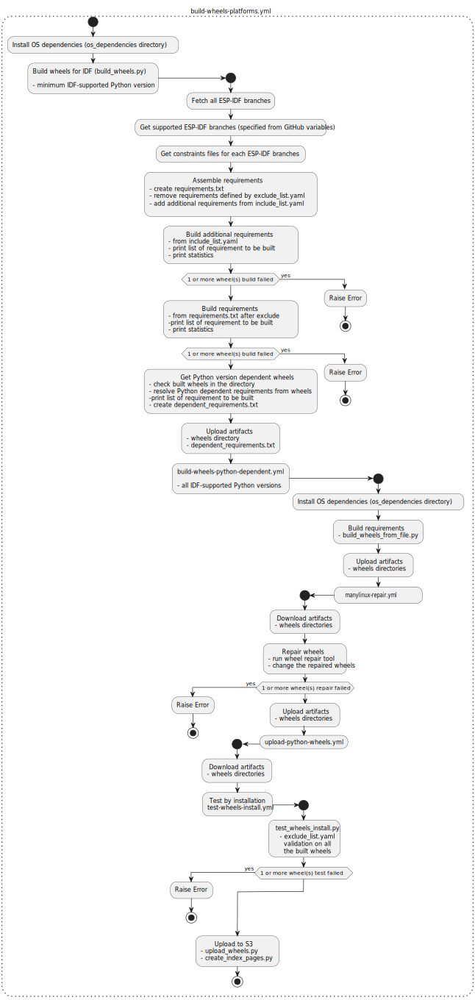

# ESPRESSIF'S IDF Python Wheels

This project automates the build and upload process of required Python Wheels by [ESP-IDF]. The wheels for multiple OSes and architectures are being built.

Supported architectures:
* Linux
    - Ubuntu  - x86_64
    - ARMv7   - arm32
    - ARM64
* Windows     - AMD64
* MacOS
    - x86_64
    - ARM64

Supported Python versions:
* 3.14
* 3.13
* 3.12
* 3.11
* 3.10
* 3.9
* 3.8

> [!NOTE]
> This list of supported Python versions is automatically updated by [update_python_versions.py](./update_python_versions.py) script and [update-python-versions.yml](./.github/workflows/update-python-versions.yml) workflow.

For each `release` branch of [ESP-IDF] which is not EOL and [ESP-IDF] `master` branch, all the requirements and constraints files are automatically downloaded and wheels are built and uploaded.

## Completely Automated
This repository has been completely automated. All the supported versions of [ESP-IDF] and Python versions are fetch and resolved automatically. The implementation of this logic is in the [supported_versions.py](./supported_versions.py) script and [get-supported-versions.yml](./.github/workflows/get-supported-versions.yml) workflow.

Also `README.md` file and `pyproject.toml` is automatically updated with the script `update_python_versions.py` and `update-python-versions.yml` workflow.

### Supported Versions Action
This workflow is reusable action and it is possible to be called in other projects - it will generate `supported_versions.json` file with the following structure, which can be parsed and used in caller workflow to avoid developer interaction of changing the supported versions.

Also it sets the `min_idf_major_version` and `min_idf_minor_version` as a GitHub env variables so this can be used as well like this:

`echo "MIN_IDF_MAJOR_VERSION=${{ needs.get-supported-versions.outputs.min_idf_major_version }}" >> $GITHUB_ENV`

    {
        "supported_idf": [
            "v5.5",
            "v5.4",
            "v5.3",
            "v5.2",
            "v5.1"
        ],
        "oldest_supported_idf": "v5.1",
        "supported_python": [
            "3.13",
            "3.12",
            "3.11",
            "3.10",
            "3.9",
            "3.8"
        ],
        "oldest_supported_python": "3.8"
    }

## Usage of Manual Wheels Build - [DEFINED WHEELS WORKFLOW](./.github/workflows/build-wheels-defined.yml)
If there is a need to manually build and upload wheels the `defined-wheels` workflow can be used for this. The pip package needs to be specified with marker support (e.g. coredump~=1.2;sys_platform!='win32') and check the architectures which should be wheels built and uploaded for. Multiple wheels can be separated by space.

Then the wheels are built and uploaded for all supported Python versions.

## Requirements Lists
These lists are files for requirements that should be added or excluded from the main requirements list which is automatically assembled.

### exclude_list.yaml
File for excluded Python packages in the **main requirements** list.

This YAML file is converted to `Requirement` from `packaging.requirements` because `pip` can handle this format, so the function for converting is designed to be compatible with [PEP508](https://peps.python.org/pep-0508/) scheme.
The opposite logic of exclude_list is handled by the function itself, which means it is supposed to be easy to use for developers, this is also the reason YAML format is used.

For every `package_name` there are options:
* `version`
    - supports all logic operators defined by [PEP508](https://peps.python.org/pep-0508/) for versions (<, >, !=, etc.)
* `platform`
* `python`

which could be a string or a list of strings.

exclude_list template:

    - package_name: '<name_of_package>'
        version: '<package_version_with_operator>' / ['<package_version_with_operator>', '<package_version_with_operator>']     # optional
        platform: '<platform>' / ['<platform>', '<platform>', '<platform>']                                                     # optional
        python: '<python_version_with_operator>' / ['<python_version>', '<python_version>', '<python_version>']                                                     # optional

The syntax can be converted into a sentence: "From assembled **main requirements** exclude `package_name` with `version` on `platform` for `python` version".

example:

    - package_name: 'pyserial'
        version: ['>=3.3', '<3.6']
        platform: ['win32', 'linux', 'darwin']
        python: '>=3.9'

This would mean: "From assembled **main requirements** exclude `pyserial` with version `>=3.3` and `<3.6` on platform `win32`, `linux`, `darwin` for `python` version `>=3.9`".

From the example above is clear that the `platform` could be left out (because all main platforms are specified) so the options `platform` or `version` or `python` are optional, one of them or both can be not specified and the key can be erased. When only `package_name` is given the package will be excluded from **main requirements**.

### include_list.yaml
File for additional Python packages to the **main requirements** list. Built separately to not restrict the **main requirements** list.

The syntax can be also converted into a sentence: "For assembled **main requirements** additionally include `package_name` with `version` on `platform` for `python` version".

### build_requirements.txt
File for the requirements needed for the build process and the build script.

### os_dependencies
When there is a need for additional OS dependencies to successfully build the wheels on a specific platform and architecture, the `.sh` script in the `os_dependencies` directory can be adjusted.

## Universal wheel tag - linking of dynamic libraries
The repair tools are used after build to link and bundle all the needed libraries into the wheel to produce correct universal tag and working wheel. If this is not able to achieve the broken wheel is deleted and not published to Espressif's PyPI.

- [`auditwheel`](https://github.com/pypa/auditwheel) package to repair Linux's `manylinux` wheels
- [`delocate`](https://github.com/matthew-brett/delocate) package to repair Mac's dynamically linked libraries
- [`delvewheel`](https://github.com/adang1345/delvewheel) package to repair Windows's DLLs

This logic is done by the [repair workflow](./.github/workflows/wheels-repair.yml) and the [`repair_wheels.py` script](./repair_wheels.py)

## Activity Diagram
The main file is `build-wheels-platforms.yml` which is scheduled to run periodically to build Python wheels for any requirement of all [ESP-IDF]-supported versions.

*The diagram was generated with the open-source tool [PlantUML](https://plantuml.com) (and edited)*

> [!NOTE]
> **Python version dependent wheels explanation**
>
> Python dependent wheels are wheels which depend on the [CPython’s Application Binary Interface (ABI)](https://docs.python.org/3/c-api/stable.html). These are checked based on the [wheel filename format](https://peps.python.org/pep-0491/#file-format) where the `abi tag` is checked for `cp`. Such wheels need to be build also for all supported Python versions, not only for the minimum Python version supported by [ESP-IDF].

[ESP-IDF]: https://github.com/espressif/esp-idf
