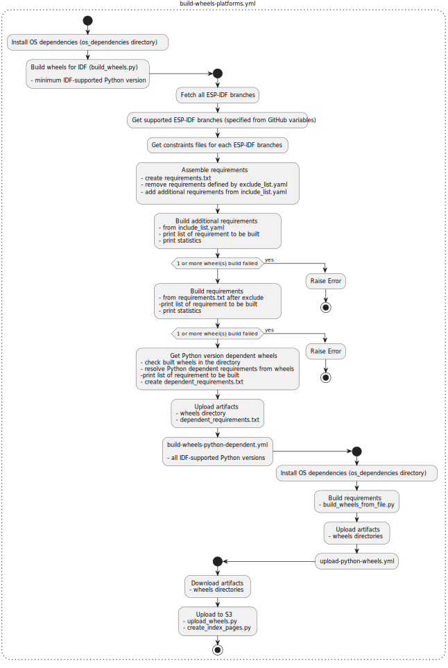

# ESP idf-python-wheels

This project automates the build and upload process of required Python Wheels by [ESP-IDF]. The wheels for multiple OSes and architectures are being built.

Supported architectures:
* Linux
    - Ubuntu  - x86_64
    - ARMv7   - arm32
    - ARM64
* Windows     - AMD64
* MacOS
    - x86_64
    - ARM64

Supported Python versions:
* 3.8
* 3.9
* 3.10
* 3.11
* 3.12
* 3.13

For each `release` branch of [ESP-IDF] starting from the version defined in GitHub variables and [ESP-IDF] `master` branch all the requirements and constraints files are automatically downloaded and wheels are built and uploaded.

## Configuration
`MIN_IDF_MAJOR_VERSION` and `MIN_IDF_MINOR_VERSION` GitHub variables can be set in project settings
to change the [ESP-IDF] `release` branches to build wheels for. If these variables are not set (not in the environment for [build-wheels-platforms.yml](./.github/workflows/build-wheels-platforms.yml)), the default values specified in [build_wheels.py](./build_wheels.py) are used.

## Usage of manual wheels build - defined wheels workflow
If there is a need to manually build and upload wheels the `defined-wheels` workflow can be used for this. The pip package needs to be specified with marker support (e.g. coredump~=1.2;sys_platform!='win32') and check the architectures which should be wheels built and uploaded for. Multiple wheels can be separated by space.

Then the wheels are built and uploaded for all supported Python versions.

## Requirements lists
These lists are files for requirements that should be added or excluded from the main requirements list which is automatically assembled.

### exclude_list.yaml
File for excluded Python packages in the **main requirements** list.

This YAML file is converted to `Requirement` from `packaging.requirements` because `pip` can handle this format, so the function for converting is designed to be compatible with [PEP508](https://peps.python.org/pep-0508/) scheme.
The opposite logic of exclude_list is handled by the function itself, which means it is supposed to be easy to use for developers, this is also the reason YAML format is used.

For every `package_name` there are options:
* `version`
    - supports all logic operators defined by [PEP508](https://peps.python.org/pep-0508/) for versions (<, >, !=, etc.)
* `platform`
* `python`

which could be a string or a list of strings.

exclude_list template:

    - package_name: '<name_of_package>'
        version: '<package_version_with_operator>' / ['<package_version_with_operator>', '<package_version_with_operator>']     # optional
        platform: '<platform>' / ['<platform>', '<platform>', '<platform>']                                                     # optional
        python: '<python_version_with_operator>' / ['<python_version>', '<python_version>', '<python_version>']                                                     # optional

The syntax can be converted into a sentence: "From assembled **main requirements** exclude `package_name` with `version` on `platform` for `python` version".

example:

    - package_name: 'pyserial'
        version: ['>=3.3', '<3.6']
        platform: ['win32', 'linux', 'darwin']
        python: '>=3.9'

This would mean: "From assembled **main requirements** exclude `pyserial` with version `>=3.3` and `<3.6` on platform `win32`, `linux`, `darwin` for `python` version `>=3.9`".

From the example above is clear that the `platform` could be left out (because all main platforms are specified) so the options `platform` or `version` or `python` are optional, one of them or both can be not specified and the key can be erased. When only `package_name` is given the package will be excluded from **main requirements**.

### include_list.yaml
File for additional Python packages to the **main requirements** list. Built separately to not restrict the **main requirements** list.

The syntax can be also converted into a sentence: "For assembled **main requirements** additionally include `package_name` with `version` on `platform` for `python` version".

### build_requirements.txt
File for the requirements needed for the build process and the build script.

### os_dependencies
When there is a need for additional OS dependencies to successfully build the wheels on a specific platform and architecture, the `.sh` script in the `os_dependencies` directory can be adjusted.

## Activity diagram
The main file is `build-wheels-platforms.yml` which is scheduled to run periodically to build Python wheels for any requirement of all [ESP-IDF]-supported versions.

*The diagram was generated with the open-source tool [PlantUML](https://plantuml.com) (and edited)*

> [!NOTE]
> **Python version dependent wheels explanation**
>
> Python dependent wheels are wheels which depend on the [CPython’s Application Binary Interface (ABI)](https://docs.python.org/3/c-api/stable.html). These are checked based on the [wheel filename format](https://peps.python.org/pep-0491/#file-format) where the `abi tag` is checked for `cp`. Such wheels need to be build also for all supported Python versions, not only for the minimum Python version supported by [ESP-IDF].

[ESP-IDF]: https://github.com/espressif/esp-idf
